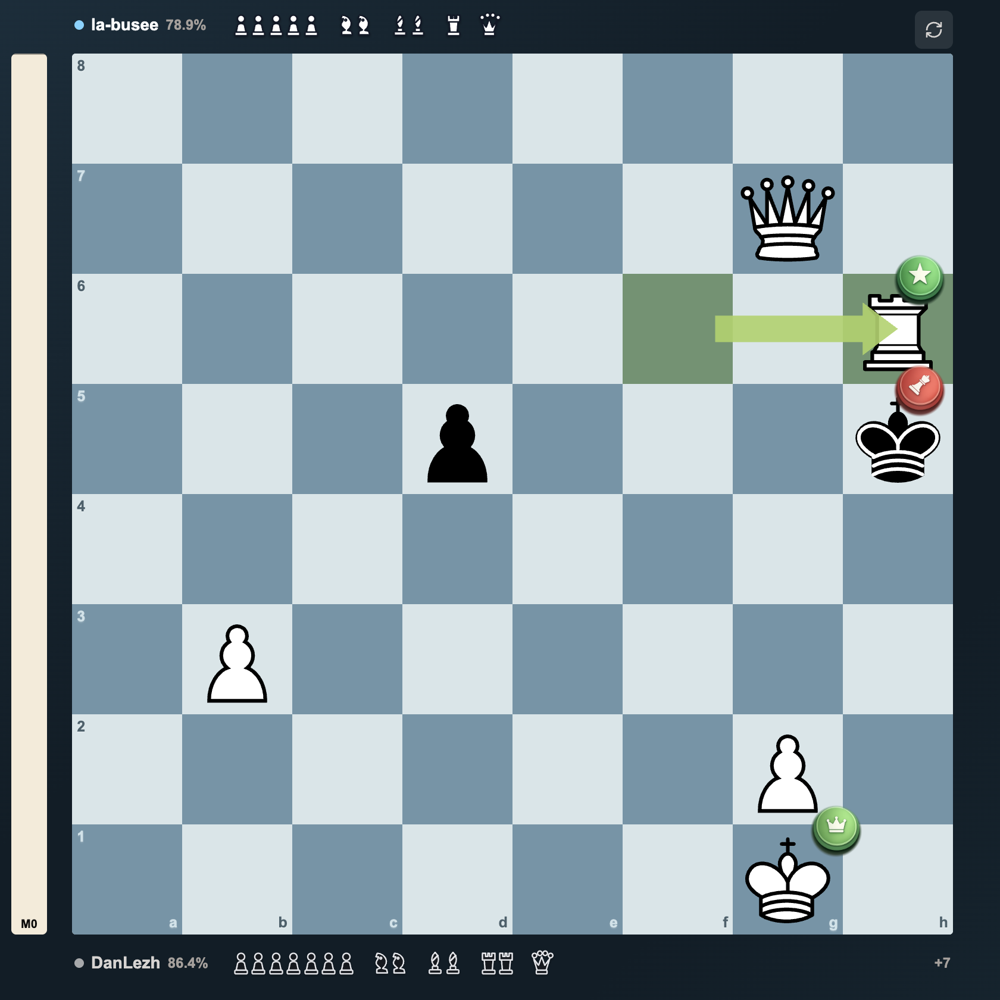
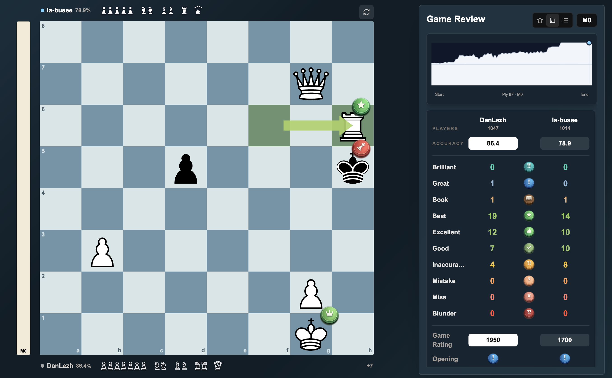

# Chess Review

[Live demo](https://chessreview-app.vercel.app) | [API health](https://backend-eight-indol-21.vercel.app/api/health)

Chess Review is a full-stack chess analysis app for reviewing PGN games move by move. It combines engine evaluation, practical move classifications, opening detection, account-backed game history, and a responsive review board in one workflow.



### Full Game Review

The analysis workspace keeps the board, evaluation graph, player accuracy, and move-classification summary visible together.



## Features

- Paste or upload PGN files and reject malformed game data with clear errors
- Review every move with evaluations, best lines, classifications, and explanations
- Explore positions on an interactive board with captured pieces and an evaluation bar
- Search and sort saved games by player, opening, result, and date
- Sign in with Google through Supabase Auth
- Keep guest data separate from each signed-in account
- Sync saved games and profile data across sign-out, refresh, and sign-in
- Browse a curated collection of public games
- Use Stockfish when available, with a deterministic fallback for serverless environments
- Run on desktop and mobile layouts

## Architecture

```text
Next.js frontend
  |-- Supabase Auth + Postgres (profiles and saved games)
  |-- FastAPI analysis API
        |-- python-chess
        |-- Stockfish when installed
        `-- heuristic fallback otherwise
```

The frontend is deployed on Vercel. The FastAPI backend is deployed as a separate Vercel project. Supabase Row Level Security restricts profiles and saved games to their owning user.

## Tech Stack

- Next.js 16, React, TypeScript, Tailwind CSS
- Chessground and chess.js
- FastAPI, Pydantic, python-chess
- Stockfish via UCI
- Supabase Auth and Postgres
- Vercel

## Run Locally

Requirements:

- Node.js 20+
- Python 3.12
- Stockfish recommended for full engine analysis

From the repository root:

```bash
npm run dev
```

The launcher installs missing dependencies, starts the API on port `8000`, and starts the frontend on port `3000` or the next available local port.

For manual setup:

```bash
cd frontend
npm install
cp .env.example .env.local
npm run dev
```

```bash
cd backend
python3 -m venv .venv
source .venv/bin/activate
pip install -r requirements.txt
cp .env.example .env
uvicorn app.main:app --reload --port 8000
```

## Environment Variables

Frontend:

```dotenv
NEXT_PUBLIC_API_URL=http://localhost:8000
NEXT_PUBLIC_SUPABASE_URL=
NEXT_PUBLIC_SUPABASE_ANON_KEY=
```

Backend:

```dotenv
STOCKFISH_PATH=
ENGINE_DEPTH=12
ALLOWED_ORIGINS=http://localhost:3000
ALLOWED_ORIGIN_REGEX=
```

Only public Supabase client values belong in the frontend. Do not commit service-role keys, OAuth client secrets, or local `.env` files.

## Supabase Setup

1. Create a Supabase project and run [`supabase/schema.sql`](supabase/schema.sql).
2. Enable Google under Authentication providers.
3. Add the Supabase callback URL to the Google OAuth client.
4. Add local and production app URLs to Supabase redirect URLs.
5. Set the frontend environment variables locally and in Vercel.

The schema enables Row Level Security and owner-only policies for `profiles` and `user_games`.

## Validation

```bash
npm run build
npm run lint
npm test
```

Backend tests cover invalid PGN handling and core move-classification behavior. GitHub Actions runs the production frontend build and backend test suite on pushes and pull requests.

## Project Structure

```text
backend/             FastAPI analysis service and tests
frontend/            Next.js application and static assets
scripts/             Local launcher and public-game importer
supabase/schema.sql  Database schema, trigger, grants, and RLS policies
samples/             Sample PGN
```

## Analysis Notes

Stockfish produces the strongest and most accurate review. When a Stockfish binary is unavailable, the API returns a heuristic analysis so the app remains usable in constrained serverless environments. The response identifies which analysis source was used.

## License

MIT. See [`LICENSE`](LICENSE).
